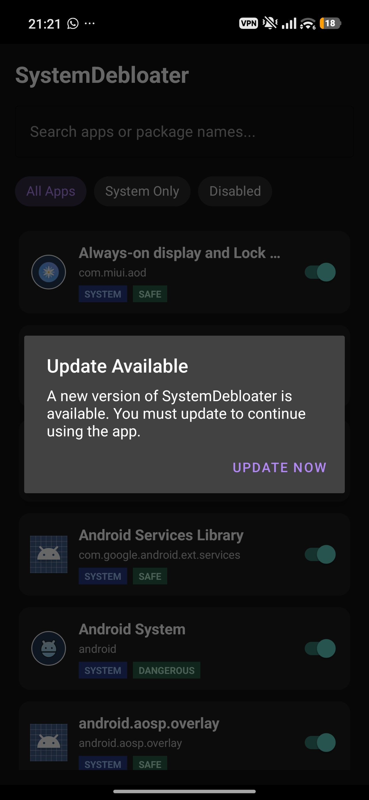
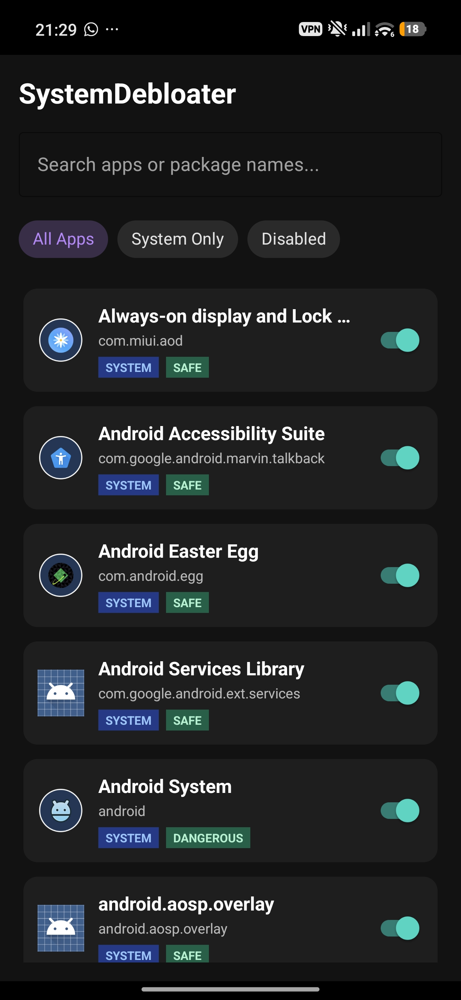
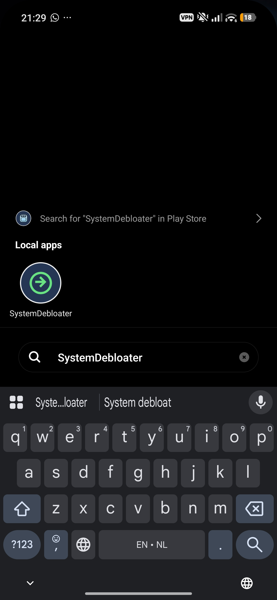
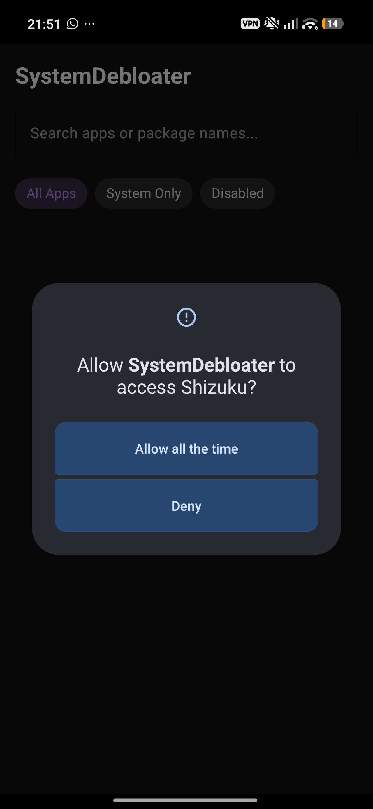

# SystemDebloater

> Built mostly with pure **Vibe Coding** ⚡

**SystemDebloater** is a modern, non-root Android utility designed to disable or remove bloatware using [Shizuku](https://shizuku.rikka.app/). It features app safety categorization, live search/filtering, and an integrated auto-updater.

---

## 📸 Screenshots

| Screen 1 | Screen 2 |
| :---: | :---: |
|  |  |

| Screen 3 | Screen 4 |
| :---: | :---: |
|  |  |

---

## 🚀 Features

* **Shizuku Integration:** Debloat system apps without requiring full root access or a PC.
* **Safety Categorization:** Automatic classification of apps (`SAFE`, `MID`, `DANGEROUS`) to prevent accidental bricking or disabling critical OS services.
* **Smart Filtering & Search:** Instant search by application name or package name with filters for **All Apps**, **System Only**, and **Disabled**.
* **Debloating Mechanism:** Uses `pm disable-user` with automatic fallback to `pm uninstall -k --user 0` for protected packages.
* **Auto-Update Engine:** Built-in update checker that notifies users when a new version is released on GitHub.
* **Material 3 UI:** Clean, dark-mode-first user interface built with Material Components.

---

## 🛠️ Architecture & Tech Stack

* **Development Style:** 90% Vibe Coding + AI Collaboration
* **Language:** Kotlin
* **UI Components:** Material Components 3, `RecyclerView`, `TextInputLayout`, `ChipGroup`
* **API Integration:** Shizuku API & ADB shell execution
* **Networking:** Native `HttpURLConnection` for lightweight update checking (`AppUpdater`)
* **Minimum SDK:** Android 8.0 (API Level 26+)

---

## 🛡️ Safety Classifications

| Safety Level | Description | Recommended Action |
| :--- | :--- | :--- |
| **SAFE** | User apps, third-party utilities, and non-essential bloatware. | Safe to disable or uninstall. |
| **MID** | Secondary system services, vendor companion apps, or regional extras. | Proceed with caution. Disabling may break specific features. |
| **DANGEROUS** | Core system apps, system UI, telephony, and security packages. | **Do not disable** unless you know exactly what you are doing. |

---

## 📦 Project Structure

